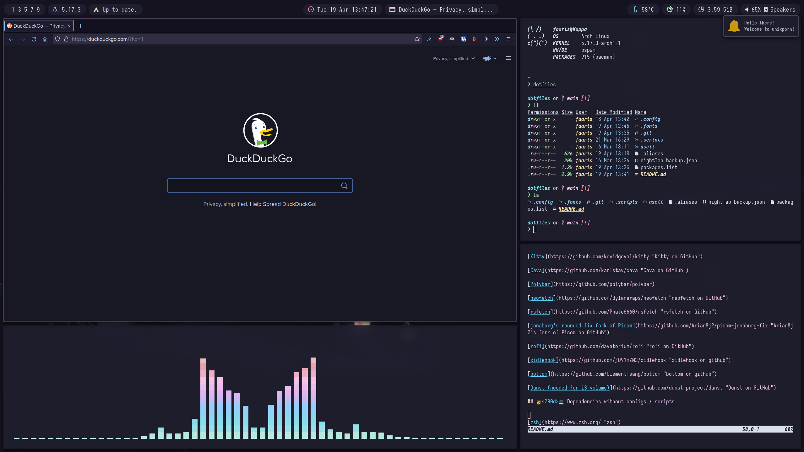

# 📖 Jump to

[dotfiles](https://github.com/FaarisAnsari/dotfiles#-dotfiles)

[Permissions](https://github.com/FaarisAnsari/nord-dotfiles#-permissions)

[Wallpapers](https://github.com/FaarisAnsari/nord-dotfiles#%EF%B8%8F-wallpapers)

[Dependencies](https://github.com/FaarisAnsari/nord-dotfiles#-dependencies)

[Dependencies without configs](https://github.com/FaarisAnsari/nord-dotfiles#-dependencies-without-configs)

[Optional Apps](https://github.com/FaarisAnsari/nord-dotfiles#use-these-if-you-want-some-of-the-programs-that-i-use-in-the-screenshots)

[Installation](https://github.com/FaarisAnsari/nord-dotfiles#%EF%B8%8F-installation)

# 🔷 dotfiles
Dotfiles for my Arch linux configurations, edited and maintained by FaarisAnsari.



## 🙏 Permissions
All of these are free to use! I've uploaded them in a way where all files are where you need them to be when you clone.

## 🖥️ Wallpapers
These wallpapers were made with the work of catppuccinFactory!

[catFactory](https://github.com/FaarisAnsari/catppuccin-factory "catFactory on GitHub")

## 👨‍💻 Dependencies

[bspwm (rounded corners)](https://github.com/phuhl/bspwm-rounded "bspwm on GitHub")

[NightTab](https://addons.mozilla.org/en-GB/firefox/addon/nighttab/ "NightTab on Firefox Webstore")

[Kitty](https://github.com/kovidgoyal/kitty "Kitty on GitHub")

[Cava](https://github.com/karlstav/cava "Cava on GitHub")

[Polybar](https://github.com/polybar/polybar)

[neofetch](https://github.com/dylanaraps/neofetch "neofetch on GitHub")

[rsfetch](https://github.com/Phate6660/rsfetch "rsfetch on GitHub")

[jonaburg's rounded fix fork of Picom](https://github.com/Arian8j2/picom-jonaburg-fix "Arian8j2's fork of Picom on GitHub")

[rofi](https://github.com/davatorium/rofi "rofi on GitHub")

[xidlehook](https://github.com/jD91mZM2/xidlehook "xidlehook on github")

[bottom](https://github.com/ClementTsang/bottom "bottom on github")

[Dunst (needed for i3-volume)](https://github.com/dunst-project/dunst "Dunst on GitHub")

[i3-volume](https://github.com/hastinbe/i3-volume "i3-volume on GitHub")

## 👩‍💻 Other Useful Tidbits


[zsh](https://www.zsh.org/ "zsh")

[OhMyZsh](https://github.com/ohmyzsh/ohmyzsh "OhMyZsh on GitHub")

[Starship Prompt](https://github.com/starship/starship "Starship on github")

[rsClock](https://github.com/valebes/rsClock "rsClock on GitHub")

[Librewolf](https://librewolf.net/ "librewolf")

## ✔️ Installation

```
$ git clone https://github.com/Fxzzi/.dots.git & ./.dots/install
```
This will create symlinks and overwrite files. It will also install all packages from packages.list. Please backup your current configs before installing!
