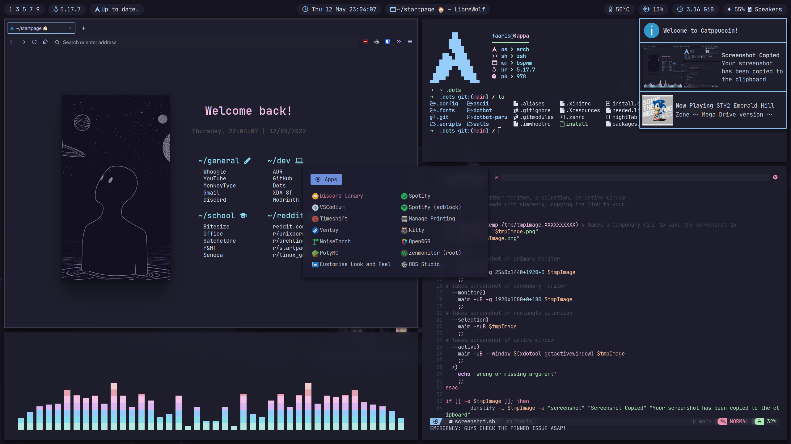

<h1 align="center">⚈ dots</h1>
<h1 align="center">by fxzzi.</h1>



## ✔️ Installation

```
$ git clone https://github.com/Fxzzi/.dots.git & ./.dots/install
```
This will create symlinks and overwrite files. It will also install all packages from packages.list. Please backup your current configs before installing!

## 🖥️ Wallpapers
These wallpapers were made with the work of [Catppuccin Factory!](https://github.com/FaarisAnsari/catppuccin-factory "catFactory on GitHub")

## 👨‍💻 Dependencies

<details>
  <summary>Click to expand!</summary>
  
[bspwm (rounded corners)](https://github.com/phuhl/bspwm-rounded "bspwm on GitHub")

[NightTab](https://addons.mozilla.org/en-GB/firefox/addon/nighttab/ "NightTab on Firefox Webstore")

[Kitty](https://github.com/kovidgoyal/kitty "Kitty on GitHub")

[Cava](https://github.com/karlstav/cava "Cava on GitHub")

[Polybar](https://github.com/polybar/polybar)

[neofetch](https://github.com/dylanaraps/neofetch "neofetch on GitHub")

[rsfetch](https://github.com/Phate6660/rsfetch "rsfetch on GitHub")

[jonaburg's rounded fix fork of Picom](https://github.com/Arian8j2/picom-jonaburg-fix "Arian8j2's fork of Picom on GitHub")

[rofi](https://github.com/davatorium/rofi "rofi on GitHub")

[xidlehook](https://github.com/jD91mZM2/xidlehook "xidlehook on github")

[bottom](https://github.com/ClementTsang/bottom "bottom on github")

[Dunst (needed for i3-volume)](https://github.com/dunst-project/dunst "Dunst on GitHub")

[i3-volume](https://github.com/hastinbe/i3-volume "i3-volume on GitHub")
</details>
  
## 👩‍💻 Other Useful Tidbits

<details>
  <summary>Click to expand!</summary>
  
[zsh](https://www.zsh.org/ "zsh")

[OhMyZsh](https://github.com/ohmyzsh/ohmyzsh "OhMyZsh on GitHub")

[Starship Prompt](https://github.com/starship/starship "Starship on github")

[rsClock](https://github.com/valebes/rsClock "rsClock on GitHub")

[Librewolf](https://librewolf.net/ "librewolf")

</details>
